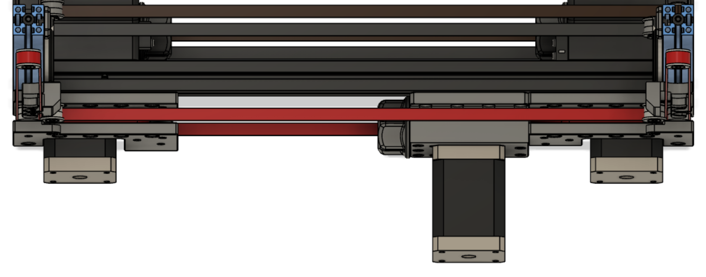
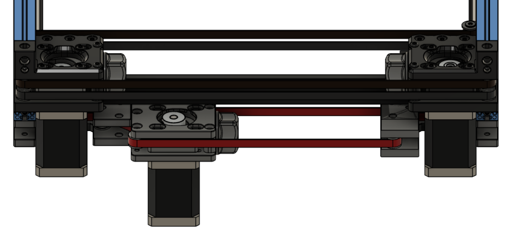
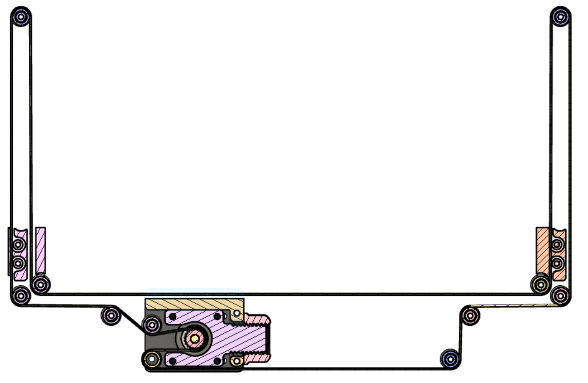
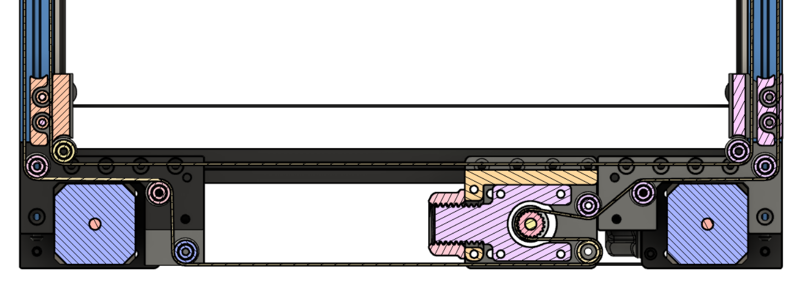
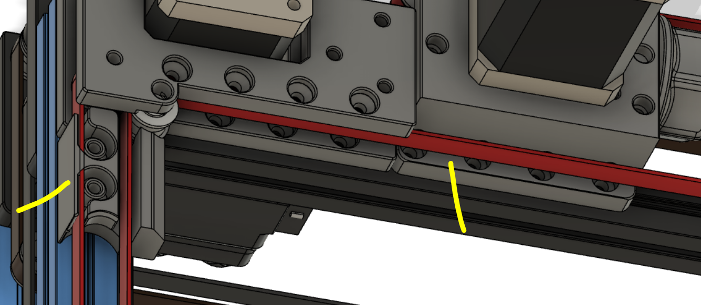

# double-dragon

first draft on a single stepper y-drive layout from zruncho double-dragon design.

obvious weaknesses (yellow lines)

- not enough distance to the panel
- weak connection of the y-drive-frame to extrusion

zrunchos original design: https://github.com/zruncho3d/double-dragon
